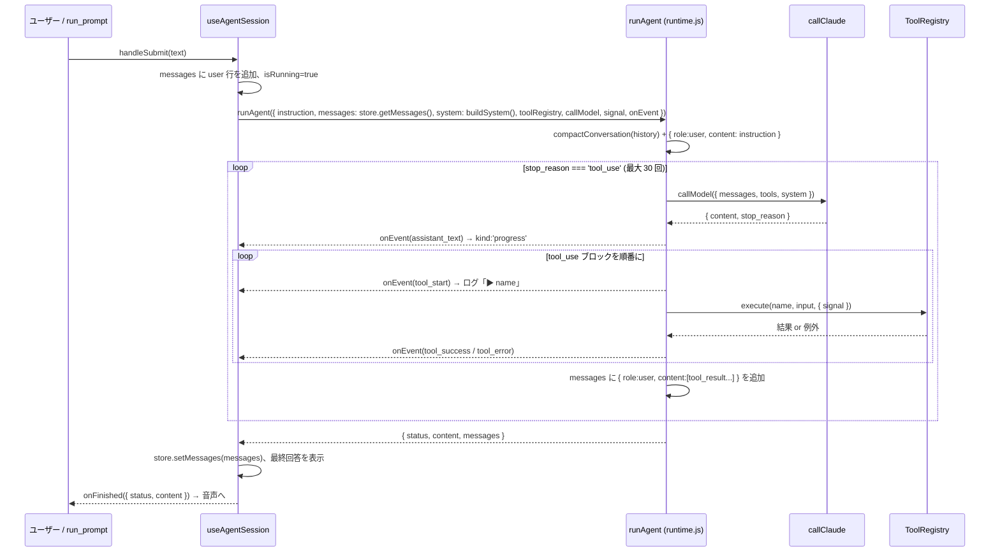

# Claude 側の仕組み — tool use ループ

対応ソース: `src/agent/runtime.js`, `src/agent/claude-client.js`, `src/agent/compaction.js`,
`src/agent/conversation-store.js`, `src/agent/system-prompt.js`, `src/agent/system-context.js`,
`src/agent/tool-registry.js`, `src/hooks/useAgentSession.js`

## 1 ターンの流れ



## runAgent（`runtime.js`）

入力: `{ instruction, messages, callModel, toolRegistry, system, maxIterations=30, signal, onEvent }`。
API 呼び出し（`callModel`）とツール実装（`toolRegistry`）を注入で受け取るため、ブラウザ非依存で `node --test` できる。

### アルゴリズム

1. 履歴に `compactConversation` を掛け、末尾に `{ role: 'user', content: instruction }` を積む。
2. `stop_reason` に応じて分岐:
   - `tool_use` — テキストブロックがあれば `assistant_text` として UI へ流し、`tool_use` ブロックを**逐次**実行
     （アプリ側ストアの状態に依存するツールがあるため並列にしない）。結果を 1 つの user メッセージにまとめて積み、ループ継続。
   - `pause_turn` — サーバー側ツールが Anthropic 側の反復上限で中断した状態。履歴そのままで再送して継続。
   - それ以外 — ループを抜けて結果を返す。
3. `maxIterations` を使い切ったら、**ツール無しで 1 回だけ**「ここまでのまとめを書け」（`ITERATION_LIMIT_WRAP_UP`）を送り、
   要約を最終回答にする。このノッジ自体は履歴に残さず、要約の assistant メッセージだけ積む。

### 戻り値の `status`

| `status` | 条件 | UI での扱い |
|---|---|---|
| `completed` | `end_turn` | 最終回答を表示 |
| `truncated` | `max_tokens` | 最終回答を表示（途中で切れている） |
| `refused` | `refusal` | 「回答が拒否されました。」（notice） |
| `stopped` | その他の `stop_reason`（`reason` に入る） | 最終回答を表示 |
| `aborted` | `signal.aborted`（中断ボタン） | 「中断しました。」（notice） |
| `iteration_limit` | 30 回到達 | 要約回答を表示 |

例外（ネットワークエラー、API エラー）は `useAgentSession` が catch して `エラー: ...`（notice）を出し、
`onFinished({ status: 'error' })` を通知する。

### onEvent の種類

| type | 付随情報 | `useAgentSession` の反応 |
|---|---|---|
| `model_request` / `model_response` | `iteration`, `stopReason` | （現状は未使用） |
| `assistant_text` | `text` | チャットに `kind: 'progress'` |
| `tool_start` | `name`, `input` | ログ `▶ name {input を 100 文字}` |
| `tool_success` | `name` | ログ `✓ name` |
| `tool_error` | `name`, `message` | ログ `✗ name: message` |

### ツール結果と自己修正

- 戻り値は文字列ならそのまま、それ以外は `JSON.stringify` して `tool_result.content` にする。
- 戻り値に `_image: { data, media_type }`（base64）があると、`content` は画像 + テキストの配列になる
  （`render_visualization` が描画結果の PNG を同梱し、Claude が自分の図を見て自己修正する経路。
  文字数上限はテキスト部にのみ適用）。runAgent の終了時には `stripToolResultImages` が画像を
  テキストのプレースホルダへ畳む（会話は localStorage に永続化されるため、ターンを跨いで base64 を持ち越さない）。
- **`TOOL_RESULT_CHAR_CAP = 8000`** 文字で打ち切り、「条件を絞って再実行せよ」という文言を付ける。
  → ツールは**要約だけ**返し、行データや地物はアプリ側ストアに置いて ID で参照させる設計が前提。
- ツールが例外を投げると `is_error: true` の `tool_result` になり、Claude がメッセージを読んで入力を直して再試行する。
  例外は握りつぶさず、**日本語で直し方が分かるメッセージ**にする（例: `タイムゾーン名が不正です: "..."（IANA 名。例: Asia/Tokyo）`）。
  `BASE_SYSTEM_PROMPT` が「同じ失敗を繰り返さない。3 回失敗したら原因と代替案を説明する」と指示している。

## ToolRegistry（`tool-registry.js`）

ツールの**定義**（Claude に渡す `{ name, description, input_schema }`）と**実装**（`handler(input, context)`）を同じ名前で 1 対 1 に管理する。
重複登録・`name` 無し・非関数ハンドラは登録時に例外。`definitions()` が `tools` パラメータに、`execute(name, input, { signal })` が実行に使われる。
未登録ツールの要求は例外 → `is_error` としてモデルに返る。

レジストリは `useAgentSession` が `createToolRegistry({ ...deps, postChatMessage, session, log })` で `useMemo` して 1 回だけ作る。
`deps` の参照が変わると作り直されるので、App では `useMemo(() => ({...}), [])` で安定させる。

## system プロンプト — 2 ブロック構成とプロンプトキャッシュ

```
[ブロック 1: 安定プレフィックス]  cache_control: ephemeral
  BASE_SYSTEM_PROMPT
  ---
  スキル 1（Markdown）
  ---
  スキル 2 ...

[ブロック 2: 揮発ブロック]        cache_control: ephemeral
  ## 現在日時
  2026-08-28（金）19:54 ローカル時刻（UTC+9）。…
  （contextParts: 現在のレイヤー一覧・選択中データなど、毎ターン評価）
```

- `composeSystemPrompt({ base, skills })` が BASE と各ソースの `skills[]` を `\n\n---\n\n` で連結する。**決定的な文字列**でなければならない
  （現在月などを入れるとプレフィックスが毎回変わりキャッシュが効かない）。
- `buildSystemBlocks({ systemPrompt, contextParts, now })` が上の 2 ブロックを返す。`contextParts` は文字列または `() => string`。
  空文字 / null は捨てる。
- プロンプトキャッシュはプレフィックス一致で効くため、リクエスト内の順序は **tools → system（安定）→ system（揮発）→ messages**。
  ツール定義が変わる（ソースを足す）とキャッシュは切れるが、それは起動時だけ。
- `BASE_SYSTEM_PROMPT` の要点: 日本語で応答／数値はツールの結果を根拠に／エラーは修正して再試行／大きな結果を持ち込まない／
  最後に 2〜4 行でまとめ／**日付は「## 現在日時」を基準に解釈し、学習時点の知識で未来か過去かを判断しない**。

## callClaude（`claude-client.js`）

- `POST https://api.anthropic.com/v1/messages`、`anthropic-version: 2023-06-01`、
  **`anthropic-dangerous-direct-browser-access: true`**（ブラウザ直叩きの明示）。
- `system` が文字列なら `cache_control` 付きの 1 ブロックに包む。配列（`buildSystemBlocks` の出力）はそのまま。
- API キーは `trim` し、**印字可能 ASCII 以外を含むと即エラー**（HTTP ヘッダは Latin-1 のみ。コピー時に紛れる全角空白対策）。
- リトライ: `429 / 500 / 529` を最大 3 回。`Retry-After`（秒）があれば優先、なければ `1000ms × 2^attempt`。`signal` で待機も中断できる。
- `fetchImpl` を注入できるのでテストで差し替える。
- `testClaudeConnection` は `GET /v1/models?limit=1000`（課金なし）でキーの有効性と、設定中のモデル名が一覧にあるかを返す
  （`{ ok, modelFound, models, message }`。UI では ok / warn（キー有効だがモデル名不明）/ error）。

## コンパクション（`compaction.js`）

`runAgent` の冒頭で履歴に適用。**直近 8 メッセージ**（`COMPACT_KEEP_RECENT_MESSAGES`）より古いメッセージの `tool_result.content` を
プレースホルダ `[古い結果は省略しました。必要なら該当ツールを再実行して取得し直してください]` に置換する。
`tool_use` ブロックと `tool_use_id` の対応は保つので API の整合性は崩れない。ツールの結果はアプリ側ストアに残る前提なので、
必要なら Claude がツールを再実行して取り直す。

## 会話の永続化（`conversation-store.js`）

`ConversationStore` は Anthropic 形式の `messages[]` を保持し、`setMessages` のたびに localStorage（`voice-agent-shell.conversation`）へ書く。
Claude API はステートレスなので、この配列を**毎ターン丸ごと送り直す**ことで文脈を維持する。`storage` / `storageKey` は注入可能
（テストや別アプリでの接頭辞変更）。`subscribe(listener)` で変更を購読できる。

`useAgentSession` はモジュールスコープで 1 つだけ作る（`agentSession = { originPrompt }` も同様で、ターン内で共有する軽い状態）。

## デバッグの勘所

- ログタブに `▶ / ✓ / ✗` でツール呼び出しが出る。`✗` が連続したらツールのエラーメッセージが Claude に伝わる形になっているか確認する。
- 「反復上限」の要約が出るときは、ツールが大きすぎる結果を返して打ち切られ、Claude が同じ呼び出しを繰り返している可能性が高い。
- 履歴が壊れたら「新しい会話」で `conversation` と `chat-view` を消す。
- 純ロジックは `node --test test/runtime.test.js` のように `callModel` を差し替えて再現できる。
