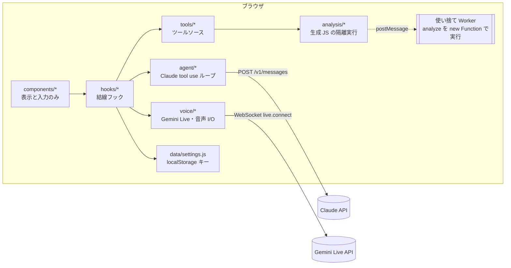
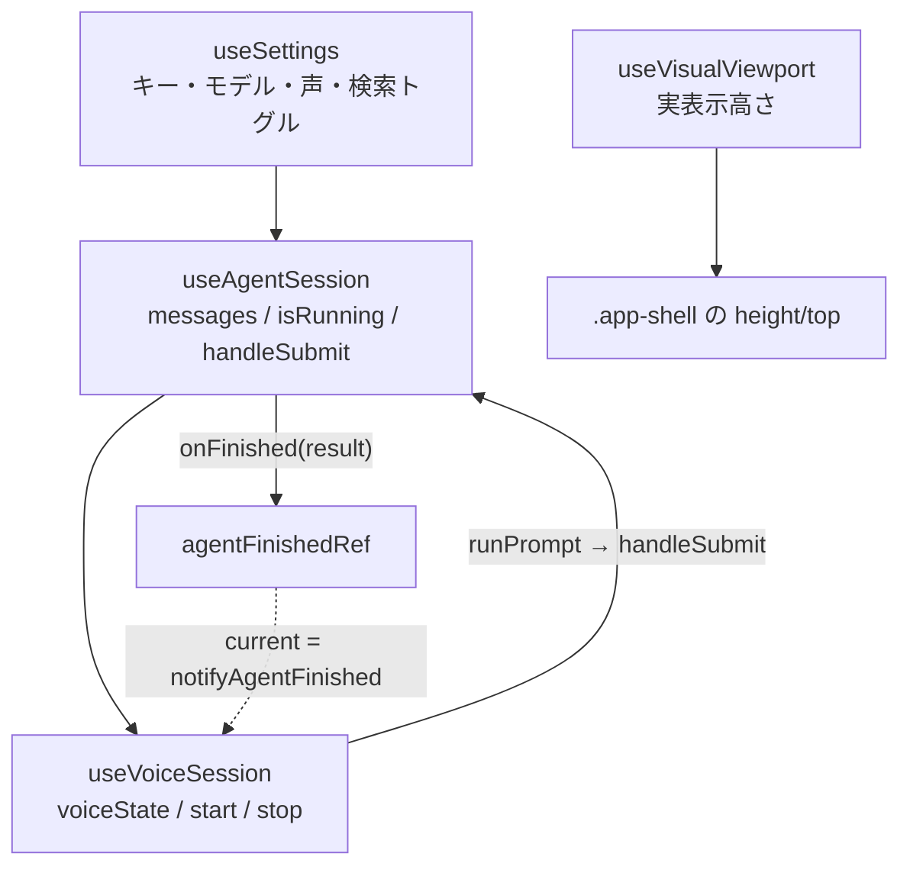

# アーキテクチャ

対応ソース: `src/App.jsx`, `src/hooks/*`, `src/data/settings.js`, `src/analysis/*`, `vite.config.js`, `src/components/*`

## 一言で

**バックエンド無し・ブラウザ完結**のエージェントシェル。2 つの LLM を役割分担させ、
**Claude** が「ツールを使う実作業」、**Gemini Live** が「音声での会話」を担当する。
ブラウザから両 API を直接叩き、API キーは利用者が画面で入力して localStorage に保存する。



## レイヤと依存の向き

| レイヤ | ディレクトリ | 責務 | import してよいもの |
|---|---|---|---|
| 表示 | `src/components/` | 表示と入力だけ。API 呼び出し・推論・ツール実行を**直書きしない** | React、`voice/voice-options.js`（定数のみ） |
| 結線 | `src/hooks/` | 状態を所有し、agent / tools / voice を組み立ててハンドラを返す | agent / tools / voice / data |
| エージェント | `src/agent/` | Claude の tool use ループ、クライアント、レジストリ、会話永続化、system プロンプト | `agent/` 内のみ（**`tools/` を import しない**） |
| ツール | `src/tools/` | ドメインのツール定義と実装。`sources.js` に一覧 | `agent/tool-registry.js`, `agent/skills/*`, `analysis/` |
| 分析実行 | `src/analysis/` | 生成 JS を使い捨て Worker で実行（検査・タイムアウト・入出力上限） | `analysis/` 内のみ（ドメイン非依存） |
| 音声 | `src/voice/` | Gemini Live 接続、マイク取得、再生、PCM 変換、指示文 | `@google/genai`（`gemini-live-client.js` のみ）、`voice/` 内 |
| データ | `src/data/` | localStorage のキーと既定値 | `voice/voice-options.js` |

依存の向きは **components → hooks → (agent | tools | voice | data)**。`agent/` と `voice/` は互いを知らず、
`tools/` も知らない。これらを繋ぐのは `src/hooks/useAgentSession.js`（tools → agent）と `src/App.jsx`（agent ↔ voice）だけ。

## App.jsx の結線

`src/App.jsx` が唯一の結線点。フックを依存順に組み立てる。



- `useAgentSession` は `useVoiceSession` より先に作られるので、完了通知は `agentFinishedRef` 経由で後段へ転送する
  （`handleAgentFinished` は `ref.current?.(result)` を呼ぶだけの安定した関数）。
- 音声からの `runPrompt` は `runPromptFromVoice` でラップし、チャットタブと右パネルを開いてから `handleSubmit` する。
- `handleNewConversation` = `handleAbort()` + `handleResetChat()` + ログ消去。

### ドメイン注入点（本アプリでは可視化ドメインが埋めている。実体は `src/App.jsx`）

| 注入点 | 型 | 用途 |
|---|---|---|
| `agentDeps` | `useMemo(() => ({...}), [])` | ツールソースの `register(registry, deps)` に渡す依存（ストア・コールバック）。**参照安定必須** |
| `buildSystem` | `() => blocks[]` | 毎ターンの system。揮発状態は `buildSystemBlocks({ contextParts })` に文字列／関数で足す |
| `voiceExtraTools` | `[{ declaration, handler }]` | Gemini に追加公開する関数（例: 画面スクショ） |
| `useVoiceSession` の `buildContext` / `buildSnapshot` | `() => string` / `() => object` | 接続時の指示文に入れる状況 ／ ツール応答に同梱する状況 |
| `ChatPanel` の `renderMessage` | `(message) => ReactNode \| null` | 独自 `kind` のメッセージ描画（チャートカード等） |
| `Header` の `leftSlot` | ReactNode | 認証バッジなど |
| `.workspace-main` の中身 | JSX | 地図・キャンバス・表などの主画面 |

本アプリでの実体: `agentDeps = { datasetStore, visualizationStore, vizBridge, getDataset, onAnalysisResult, getAnalysisResult, onVisualizationShown }`、
`contextParts = [formatDatasetList(datasets)]`、`renderMessage` は `kind:'viz'` → `VizCard`、`.workspace-main` は `DatavizWorkspace`。
可視化フレーム（`public/viz-frame.html`）は `createVizFrameBridge` を `useRef` で 1 度だけ作り、iframe 要素を `VizPanel` が DOM に載せる。

詳しい手順は [extending.md](./extending.md)。

## 画面構成

```
┌ Header ──────────────────────────────────────────────────┐
│ 🎙 voice-agent-shell  ⓘAbout  [leftSlot]    パネル◨ ⚙設定 │
├─────────────────────────────┬────────────────────────────┤
│ .workspace-main             │ Sidebar(right, 幅可変)      │
│  ドメインの主画面            │  TabbedPanel               │
│  （シェルでは空のプレース    │   ├ チャット: ChatPanel    │
│    ホルダー）               │   │   └ VoiceButton(🎙)    │
│                             │   └ ログ: ExecutionLog     │
└─────────────────────────────┴────────────────────────────┘
  モーダル: AboutModal（初回自動表示）/ AgentHelpModal（チャットの ⓘ 使い方ボタン）
  ポップオーバー: ApiSettings（⚙ 設定）
```

- `.app-shell` は `position: fixed`。`useVisualViewport` が `visualViewport` の高さ・上端を測ってインライン style で当てる
  （スマホの 100vh / 100dvh の揺れ対策。API が無い環境は CSS の `100dvh` に委ねる）。
- 720px 以下はモバイルレイアウト（`src/styles/app.css` の `@media (max-width: 720px)`）。
- `Sidebar` は `open=false` で描画しない（主画面がその分広がる）。内側の縁をドラッグで幅を、モバイルでは上縁で高さを変えられる。

### ChatPanel のメッセージ種別

`messages[]` の要素は `{ id, role, content, kind?, label? }`。

| `kind` | 出所 | 表示 |
|---|---|---|
| （なし） | ユーザー入力／Claude の最終回答 | 最終回答は Markdown（GFM）でレンダリング |
| `progress` | tool use の合間に出た Claude の説明文（`assistant_text` イベント） | 控えめ |
| `notice` | 中断・拒否・エラー | 注意色 |
| 任意（例: `chart`） | ツールからの `postChatMessage({ kind, ... })` | `renderMessage(message)` が非 null を返せばそれを描画 |

## 永続化（localStorage と IndexedDB）

アップロードしたデータ（原本とパース済み）と作成した可視化（コード + SVG のバージョン列）は **IndexedDB**
（DB 名 `voice-agent-shell.dataviz`、ストア `files` / `datasets` / `visualizations`。`src/data/dataviz-db.js`）に入れる。
ストアはメモリ優先で、IDB は書き込みの後追い（`src/data/record-store.js`）。起動時に `hydrate()` で復元し、
「新しい会話」で 3 ストアとも消す。localStorage は設定・会話・チャット表示・ログのまま。

### localStorage

`src/data/settings.js` の `STORAGE_PREFIX = 'voice-agent-shell.'` と `storageKey(name)` が唯一の情報源。

| キー（接頭辞の後） | 内容 | 書く場所 |
|---|---|---|
| `apiKey` / `model` / `maxTokens` | Claude の設定（既定: `claude-opus-4-8`, 16000） | `useSettings.save` |
| `geminiApiKey` / `voiceModel` / `voiceName` / `voiceSearch` | Gemini の設定（既定: `gemini-3.1-flash-live-preview`, `Kore`, OFF） | 同上 |
| `introSeen` | About モーダルを閉じたら `'1'` | `App` |
| `conversation` | Claude API に送る messages 配列（tool_use / tool_result を含む） | `ConversationStore` |
| `chat-view` | 画面表示用のメッセージ配列（progress / notice / 独自 kind を含む） | `useAgentSession` |
| `operation-log` | ログタブの行（直近 300 件） | `App` |

`conversation`（API 用）と `chat-view`（表示用）は別物。前者は Claude に毎回送り直す文脈で、後者は UI にだけ出る。
「新しい会話」で `conversation` / `chat-view` / `operation-log` を消す。設定は残る。
読み書きはすべて try/catch で包み、localStorage が使えない環境でもメモリ上で動く。

## ビルドと CSP（`vite.config.js`）

- `base: './'` — 相対パス出力。GitHub Pages のサブパス配信（`npm run deploy`）に対応。
- **CSP meta の注入**（本番ビルドのみ。`apply: 'build'`）:

  | ディレクティブ | 値 | 理由 |
  |---|---|---|
  | `script-src` | `'self'` | メインスレッドでは `eval` / `new Function` を使わない（`calculate` は再帰下降パーサ）。`execute_javascript` の `new Function` は Worker 側なので `'unsafe-eval'` は不要（下記） |
  | `connect-src` | `'self' https://api.anthropic.com https://generativelanguage.googleapis.com wss://generativelanguage.googleapis.com` | Claude / Gemini（HTTP と WebSocket） |
  | `img-src` | `'self' data:` | |
  | `style-src` | `'self' 'unsafe-inline'` | React のインライン style |
  | `worker-src` | `'self' blob:` | AudioWorklet と生成 JS 実行 Worker（`analysis-worker.js`） |

  可視化フォント（Noto Sans JP / Roboto Condensed）は style-src に fonts.googleapis.com、font-src に
  fonts.gstatic.com、connect-src に両ホスト（`font-embed.js` の書き出し埋め込み fetch 用）を許可している。
  **dev サーバーでは CSP が適用されない**（Vite/HMR がインライン script を注入するため）。外部ホストを増やして
  `connect-src` を更新し忘れると「dev では動くのに本番だけ壊れる」。`npm run preview` で本番相当を確認する。
- **Worker と CSP の関係**: `analysis-worker.js` は `new Worker(new URL(...), { type: 'module' })` で同一オリジンの実ファイルとして
  読み込まれる。**dedicated worker のグローバルスコープには document の meta CSP が継承されない**（worker スクリプト自身の
  レスポンスヘッダが CSP の出所になる）ため、`script-src 'self'` のままで Worker 内の `new Function` は動く。
  ビルド成果物を Chromium で実測して確認済み（CSP 違反も出ない）。逆に、配信側が全レスポンスに CSP ヘッダを付ける構成へ移す場合は
  Worker にもそれが効くので、そのときだけ `'unsafe-eval'` の要否を再確認する。
- `assetsInlineLimit` — `pcm-worklet.js` だけインライン化を禁止。worklet のモジュール取得は `script-src` の対象なので
  `data:` URL にされると CSP で弾かれる（`Unable to load a worklet's module.`）。
- `codeSplitting.groups` — `react` / `react-dom` / `scheduler` を `react` チャンクに分離。
- `@google/genai` は `useVoiceSession` の**動的 import** でのみ読むため初期チャンクに入らない。UI が音声の定数を必要とする場合は
  `voice/voice-options.js`（genai 非依存）から読む。
- `sourcemap: true`。

## コード規約（要約）

プレーン JS/JSX（TypeScript なし）、2 スペース、セミコロン無し、シングルクォート。コンポーネントは `PascalCase.jsx`、
モジュールは `kebab-case.js`。各モジュール先頭に「役割 / 関係 / 流用元」のヘッダーコメント。UI 文言・コメントは日本語。
`npm run lint` は警告 0 が条件（`dist/` は対象外）。
