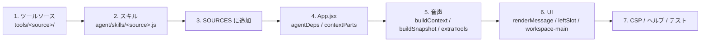

# ドメインを足す手順

対応ソース: `src/tools/example/*`, `src/tools/sources.js`, `src/tools/register-tools.js`, `src/agent/skills/example.js`,
`src/App.jsx`, `src/components/AgentHelpModal.jsx`, `src/components/AboutModal.jsx`, `test/example-tools.test.js`

このシェルは「ドメイン非依存の骨格」なので、自分のドメイン（地図・表・IoT・ドキュメント…）は次の順で足す。
同梱の `example` ソース（現在時刻・計算）が雛形。**本アプリではデータ可視化ドメイン（`src/tools/dataviz/`・`src/data/`・
`src/viz/`・`src/components/dataviz/`）がこの手順どおりに実装されている**ので、実例としてそちらも読む
（ストアをモジュールスコープに置いて `agentDeps` を参照安定にする、`contextParts` にデータ一覧、`renderMessage` に `kind:'viz'`、
`execute_javascript` の `onAnalysisResult` フックで派生データを保存、など）。



## 設計の原則（先に決めておくこと）

- **ツールは要約だけを Claude に返す。** 行データ・地物・画像はアプリ側のストア（`deps` で渡す）に置き、ID や件数で参照させる。
  `tool_result` は 8000 文字で打ち切られる（[agent-loop.md](./agent-loop.md)）。
- **例外はそのまま投げる。** runtime が `is_error` にして Claude に自己修正させる。メッセージは「何が悪く、どう直すか」が分かる日本語にする。
- **スキルは決定的な文字列。** 現在日時・ランダム値・可変の一覧を入れない（プロンプトキャッシュの安定プレフィックスに載る）。
  毎ターン変わる状態は `contextParts` で渡す。
- **ドメイン知識は「純データ（JS モジュール）→ スキルの表を生成 + 小ツール」の形にする。** 大きな知識を 1 つの巨大ツールに詰めない。
- **Gemini にはドメインのツールを渡さない。** 渡すのは `run_prompt` と「画面を見る」系の `extraTools` だけ。

## 1. ツールソースを作る

`src/tools/<source>/{index,definitions,handlers}.js`（必要なら API クライアント）。

### definitions.js — Claude に渡す JSON スキーマ

```js
export const LIST_ITEMS = 'list_items'

export const MY_TOOL_DEFINITIONS = [
  {
    name: LIST_ITEMS,
    description: '何をするか・いつ使うか・戻り値の形。Claude はこれを読んで使い方を決める。',
    input_schema: {
      type: 'object',
      properties: {
        query: { type: 'string', description: '検索語' },
        limit: { type: 'integer', description: '最大件数（既定 20）' },
      },
      required: ['query'],
    },
  },
]
```

### handlers.js — 実装

```js
export function makeMyHandlers({ store, log, postChatMessage } = {}) {
  return {
    async listItems({ query, limit = 20 } = {}) {
      const q = String(query ?? '').trim()
      if (!q) throw new Error('query が空です。検索語を指定してください。')
      const rows = await store.search(q, limit)
      log?.(`検索: ${q} → ${rows.length} 件`)
      // 行データはストアに置き、Claude には要約だけ返す。
      const id = store.saveResult(rows)
      return { resultId: id, count: rows.length, sample: rows.slice(0, 3) }
    },
  }
}
```

`deps` の共通部分はシェルが必ず渡す（`src/tools/register-tools.js` 先頭のコメント参照）:

| キー | 内容 |
|---|---|
| `postChatMessage({ kind, ... })` | チャットに任意 kind のメッセージを出す（描画は `renderMessage`） |
| `session` | `{ originPrompt }`。実行中のユーザー指示など、ターン内で共有する軽い状態 |
| `log(message)` | ログタブへ 1 行 |
| それ以外 | `App.jsx` の `agentDeps` で足したアプリ固有の依存（ストア・コールバック）。シェルは中身を見ない |

### index.js — ソース契約

```js
import { MY_SKILL } from '../../agent/skills/my-source.js'
import { LIST_ITEMS, MY_TOOL_DEFINITIONS } from './definitions.js'
import { makeMyHandlers } from './handlers.js'

const definition = (name) => MY_TOOL_DEFINITIONS.find((d) => d.name === name)

export const mySource = {
  id: 'my-source',
  skills: [MY_SKILL],                       // Markdown 文字列の配列（決定的）
  register(registry, deps = {}) {           // deps = { postChatMessage, session, log, ...アプリ固有 }
    const h = makeMyHandlers(deps)
    registry.register(definition(LIST_ITEMS), (input) => h.listItems(input))
  },
}
```

`registry.register` はチェーンできる。同名の二重登録は例外になる。

## 2. スキルを書く

`src/agent/skills/<source>.js` に Markdown 文字列を 1 つ export する。書く内容:

- 各ツールを**いつ**使うか（トリガーになる言い回し）、**どう**引数を組み立てるか、戻り値の読み方
- エラー時の直し方（`example.js` の「エラー…はメッセージを読んで式を直し、再実行する」のように）
- ドメインの語彙・ID 一覧・単位など、静的な参照表（データモジュールから生成してよい。ただし決定的に）

```js
import { DATASETS } from '../../tools/my-source/datasets.js'   // 純データ

const table = DATASETS.map((d) => `| ${d.id} | ${d.name} | ${d.unit} |`).join('\n')

export const MY_SKILL = `# スキル: 〇〇

## list_items
- 「〇〇を探して」「△△の一覧」で使う。
- 戻り値 \`{ resultId, count, sample }\`。全件が必要なら resultId を次のツールに渡す。

## データセット
| ID | 名前 | 単位 |
|---|---|---|
${table}`
```

`composeSystemPrompt` が BASE と `---` で連結する。先頭は `# スキル:` で始めると読みやすい。

## 3. `SOURCES` に追加

```js
// src/tools/sources.js
import { exampleSource } from './example/index.js'
import { mySource } from './my-source/index.js'

export const SOURCES = [exampleSource, mySource]
```

これだけでツール登録（`createToolRegistry`）とシステムプロンプト（`skills` の連結）の両方に反映される。
サンプルが不要になったら `exampleSource` を外す（`test/example-tools.test.js` と `AgentHelpModal` のサンプルも合わせて整理）。

## 4. App.jsx に依存と状態を注入

```jsx
// ストアはモジュールスコープか useRef で 1 つだけ作り、deps を参照安定にする。
const store = useMemo(() => createMyStore(), [])
const agentDeps = useMemo(() => ({ store, onLayerAdded: (l) => setLayers((cur) => [...cur, l]) }), [store])

// 毎ターン変わる状態は contextParts へ（安定プレフィックスと別ブロックなのでキャッシュを壊さない）。
const buildSystem = useCallback(
  () =>
    buildSystemBlocks({
      systemPrompt: SYSTEM_PROMPT,
      contextParts: [
        () => (layers.length ? `## 現在のレイヤー\n${layers.map((l) => `- ${l.id}: ${l.name}`).join('\n')}` : ''),
      ],
    }),
  [layers],
)
```

- `agentDeps` の参照が変わると `toolRegistry` と `handleSubmit` が作り直される。**state をそのまま deps に入れない**
  （必要なら ref 経由で読むコールバックを渡す）。
- `contextParts` は文字列でも関数でもよい。空文字は捨てられる。

## 4-b. `execute_javascript` にデータを渡す

同梱の `javascript` ソース（`src/tools/javascript/`）は、固定ツールで表現できない集計・加工を
**使い捨て Web Worker 上の生成 JavaScript** で実行する。実行基盤は `src/analysis/`（検査 → Worker → タイムアウト → 出力検証）。

既定ではデータセットの概念を持たず、`args` に渡した値だけを扱うサンドボックスとして動く。
アプリ側に行データのストアがあるなら、`agentDeps` に `getDataset(id)` を足すだけで `datasetId` / `datasetIds` が有効になる。

```jsx
const agentDeps = useMemo(
  () => ({
    store,
    // { id, records, columns, metadata } を返す（無ければ null）。
    // records は structured clone で Worker へ渡るので、関数やクラスインスタンスを含めない。
    getDataset: (id) => store.get(id),
  }),
  [store],
)
```

- `getDataset` の有無で**ツール定義自体が切り替わる**（`buildJavascriptToolDefinition({ hasDatasets })`）。
  無いのに `datasetId` を見せてモデルに誤用させない。
- 生成コードは `function analyze({ records, columns, metadata, datasets, args })` を定義し、
  JSON 互換の `{ columns, rows, notes }` を返す契約。LLM へ返すのは先頭 20 行と件数・警告だけ（全行はアプリ側が持つ）。
- 制限値（タイムアウト 5 秒 / 入力 200,000 件 / 出力 1MB）を変えるなら `deps.runOptions` に
  `{ timeoutMs, maxInputRecords, maxOutputBytes }` を渡す。
- Worker には **API キー・DOM・localStorage を渡さない**。ネットワーク・ストレージ API は実行前検査で拒否し、
  Worker 側でも `undefined` 化している（文字列検査は誤操作の早期検出にすぎず、主防御は Worker の隔離・上限・CSP）。
- 不要なら `src/tools/sources.js` の `SOURCES` から `javascriptSource` を外す（`src/analysis/` と
  `test/analysis-runner.test.js` / `test/javascript-tools.test.js` も一緒に消せる）。

## 5. 音声に状況を伝える／関数を足す

```jsx
const buildVoiceContext = useCallback(() => `## 現在のレイヤー\n${layers.map((l) => `- ${l.name}`).join('\n')}`, [layers])
const buildVoiceSnapshot = useCallback(() => ({ layers: layers.map((l) => l.name) }), [layers])

const voiceExtraTools = useMemo(
  () => [
    {
      declaration: {
        name: 'capture_screen',
        description: '現在の画面を画像として見る。ユーザーが「見て」「これ何」と言ったときに使う。',
        parameters: { type: 'OBJECT', properties: {} },
      },
      async handler(_args, { session, log }) {
        const jpegBase64 = await captureCanvas()
        session.sendImage(jpegBase64, 'image/jpeg')   // 先に画像
        log?.('画面を送信')
        return { captured: true }                       // 後で応答（snapshot がマージされる）
      },
    },
  ],
  [],
)

useVoiceSession({ ..., buildContext: buildVoiceContext, buildSnapshot: buildVoiceSnapshot, extraTools: voiceExtraTools })
```

- `buildContext()` は接続時の system instruction に入る（会話の前提）。`buildSnapshot()` は関数を呼ばれるたびに応答へ同梱される
  （会話中の変化はこれで伝える。`sendText` は使わない）。
- 戻り値に `claude_running` と衝突するキーを返さない。
- `parameters` は Gemini の形式（`type: 'OBJECT'` / `'STRING'` …）。Claude の `input_schema` とは大文字小文字が違う。
- 完了通知に補足を足したいなら、`useAgentSession` の `onFinished` をラップして `extras` を付けてから `notifyAgentFinished` に渡す
  （`buildCompletionNotice({ status, content, extras })`）。

## 6. UI に差し込む

| 場所 | やること |
|---|---|
| `ChatPanel renderMessage={(m) => m.kind === 'chart' ? <ChartCard spec={m.spec} /> : null}` | ツールが `postChatMessage({ kind: 'chart', spec })` で出したメッセージの描画。null を返すと既定の描画 |
| `Header leftSlot={<AuthBadge />}` | 認証状態バッジなど |
| `.workspace-main` の中身 | 地図・キャンバス・表。`empty-state` のプレースホルダーを置き換える |
| `AgentHelpModal` の `SAMPLE_GROUPS` | ⓘ 使い方ボタンのサンプルプロンプトをドメインのものに差し替え |
| `AboutModal` | アプリの説明を書き換え |
| `Header` の `title` | アプリ名 |

`components/` には API 呼び出しを書かない。表示に必要なデータは props で受ける。

## 7. CSP・ヘルプ・テスト

- **CSP**（`vite.config.js`）: 外部 API を叩くなら `connect-src`、外部画像なら `img-src` に追加。タイルサーバーやフォントも同様。
  **メインスレッドで** `new Function` / `eval`（例: 式評価ライブラリ、一部の WASM ローダ）を使うなら `script-src` に `'unsafe-eval'`。
  `execute_javascript` は Worker 内で `new Function` を使うが、Worker には document の meta CSP が継承されないので追加不要。
  dev では CSP が効かないので `npm run preview` で確認する。
- **localStorage**: 新しいキーは `storageKey('my-thing')` で作る（`src/data/settings.js`）。「新しい会話」で消すべきものは
  `handleNewConversation` に足す。
- **テスト**: ブラウザ非依存の純ロジック（パーサ、集計、スキル生成、ハンドラ）を `test/<source>.test.js` に書く。
  ハンドラは `now` / `fetchImpl` などの注入点を持たせて固定する（`test/example-tools.test.js` 参照）。

```js
import test from 'node:test'
import assert from 'node:assert/strict'
import { ToolRegistry } from '../src/agent/tool-registry.js'
import { mySource } from '../src/tools/my-source/index.js'

test('my-source はツールを登録し、要約だけ返す', async () => {
  const registry = new ToolRegistry()
  const store = { search: async () => [{ id: 1 }, { id: 2 }], saveResult: () => 'r1' }
  mySource.register(registry, { store, log: () => {} })
  const out = await registry.execute('list_items', { query: 'x' })
  assert.deepEqual(out, { resultId: 'r1', count: 2, sample: [{ id: 1 }, { id: 2 }] })
})
```

- 追加した依存は `npm run lint`（警告 0）と `npm test` を通す。

## チェックリスト

- [ ] ツールは要約だけ返し、生データはストアに置いた
- [ ] 例外メッセージは直し方が分かる日本語
- [ ] スキルに揮発情報（現在日時・可変一覧）を入れていない
- [ ] `agentDeps` は `useMemo` で参照安定
- [ ] 毎ターン変わる状態は `contextParts` に入れた
- [ ] 音声の状態は `buildContext` / `buildSnapshot` で伝え、`sendText` を使っていない
- [ ] 画像を送る extraTools は「画像 → 応答」の順
- [ ] `components/` に API 呼び出しを書いていない
- [ ] 外部ホストを CSP に足し、`npm run preview` で確認した
- [ ] `AgentHelpModal` / `AboutModal` をドメインに合わせた
- [ ] `npm run lint` と `npm test` が通る
