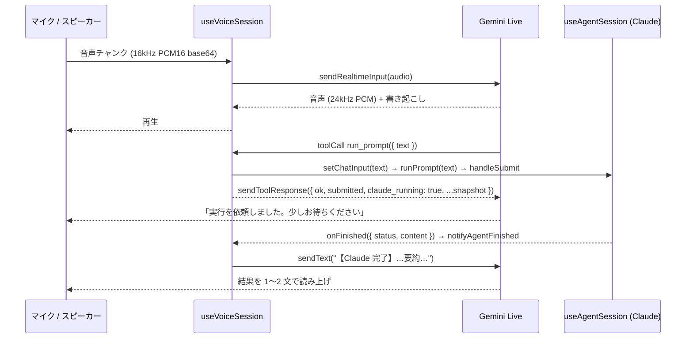

# Gemini Live 側の仕組み — 音声セッション

対応ソース: `src/hooks/useVoiceSession.js`, `src/voice/gemini-live-client.js`, `src/voice/voice-tools.js`,
`src/voice/voice-instruction.js`, `src/voice/audio-capture.js`, `src/voice/audio-player.js`, `src/voice/pcm.js`,
`src/voice/pcm-worklet.js`, `src/voice/voice-options.js`, `src/voice/gemini-test.js`

## 役割

Gemini Live は**会話担当**。処理はしない。ユーザーと話して Claude への指示文を組み立て、`run_prompt` で
チャットに書き込んで送信し、Claude の完了通知を受けて要約を読み上げる。**ドメインのツールは渡さない**。



## 状態遷移

```
idle ──start()──► connecting ──接続+マイク OK──► listening ◄──再生終了── speaking
 ▲                    │                              │ 再生開始 ▲
 │                    └─失敗─► error ◄───────────────┘─────────┘
 └──── stop() / サーバー切断 / アンマウント（teardown）──────────┘
```

- `voiceState`: `idle | connecting | listening | speaking | error`。`speaking` ⇄ `listening` は `audio-player` の
  `onStateChange(playing)` で切り替える。`isLive = listening || speaking`。
- `error` は `fail(message)` で入る（ログに `✗ 音声:` を残し teardown）。`error` のままにするので画面にメッセージが残る。
- `teardown` は「マイク停止 → `audioStreamEnd` 送信 → セッション close → プレーヤー close」の順。二重実行は `stoppingRef` で防ぐ。
- `elapsed` は `listening / speaking` の間だけ 1 秒ごとに増える（ボタンに `m:ss` で表示）。

## 音声パイプライン

### 入力（`audio-capture.js` → `pcm-worklet.js` → `pcm.js`）

1. `getUserMedia({ audio: { channelCount: 1, echoCancellation: true, noiseSuppression: true, autoGainControl: true } })`
   — エコーキャンセルはスピーカーから出る Gemini の声を拾い直さないため。
2. `new AudioContext({ sampleRate: 16000 })`（Gemini Live の前提）。ブラウザが従わない場合があるので**実際の `context.sampleRate` を返し**、
   `sendAudio(base64, sampleRate)` の `mimeType: audio/pcm;rate=<実値>` に使う。
3. `audioWorklet.addModule(new URL('./pcm-worklet.js', import.meta.url))` — `PcmCaptureProcessor` は入力の Float32 をコピーして
   `postMessage` するだけ（AudioWorklet スコープには `window` も `import` も無い）。
4. メインスレッドで `float32ToBase64Pcm16`（クリップ → Int16 → little-endian → base64。`btoa` の引数上限対策で 32KB ごとに分割）。
5. worklet → ゲイン 0 のノード → destination と繋ぐ（繋がないと `process` が回らないブラウザがある。ゲイン 0 でハウリング防止）。

途中で失敗したら `stream.getTracks().forEach(stop)` でマイクを掴んだままにしない。

### 出力（`audio-player.js`）

- 24kHz の `AudioContext` を遅延生成。`enqueue(base64)` で `base64Pcm16ToFloat32` → `AudioBuffer` → `BufferSource` を
  `max(currentTime + SCHEDULE_AHEAD, nextStartTime)` に予約し、チャンクを途切れなく連結する。
- `flush()` は予約済みをすべて `stop()`（ユーザーの割り込み `interrupted` で呼ぶ）。
- `onStateChange(playing.size > 0)` で `speaking` / `listening` を切り替える。
- ユーザー操作前に作った `AudioContext` は `suspended` のことがあるので `resume()` を試みる。
  → **マイク開始はクリックハンドラから同期的に始める**（ブラウザの権限・自動再生ポリシー）。

## 接続設定（`gemini-live-client.js`）

`connectGeminiLive({ apiKey, model, systemInstruction, callbacks, enableSearch, voiceName, tools, sdk })` が
`@google/genai` の `ai.live.connect` を包む**唯一の場所**。`useVoiceSession` から動的 import される。

| config | 値 | 理由 |
|---|---|---|
| `responseModalities` | `[AUDIO]` | 音声のみで応答 |
| `systemInstruction` | `buildVoiceInstruction(...)` | 下記 |
| `tools` | `buildLiveTools({ enableSearch, tools })` | `run_prompt` + extraTools（+ `googleSearch`） |
| `speechConfig.voiceConfig.prebuiltVoiceConfig.voiceName` | `normalizeVoiceName(voiceName)`（一覧に無ければ `Kore`） | 声色 |
| `outputAudioTranscription` / `inputAudioTranscription` | `{}` | 画面表示用の書き起こしを受け取る |
| `mediaResolution` | `MEDIA_RESOLUTION_MEDIUM` | 画像（スクショ）の文字が読める程度 |
| `contextWindowCompression` | `{ slidingWindow: {} }` | 既定のセッション上限（音声のみ 15 分）で切れないよう履歴を圧縮 |

既定モデルは `gemini-3.1-flash-live-preview`、既定の声は `Kore`（`voice-options.js`。30 種の prebuilt voice を UI に出す）。
native audio モデルは言語を自動判別するので言語指定はせず、指示文で「日本語で話す」と指示する。

### 受信メッセージのルーティング（`routeMessage`）

| メッセージ | コールバック | `useVoiceSession` の反応 |
|---|---|---|
| `setupComplete` | `onReady` | — |
| `serverContent.modelTurn.parts[].inlineData` | `onAudio(base64)` | `player.enqueue` |
| `serverContent.outputTranscription.text` | `onOutputTranscript` | `transcript` に追記（ボタン下に表示） |
| `serverContent.inputTranscription.text` | `onInputTranscript` | — |
| `serverContent.interrupted` | `onInterrupted` | `player.flush()`、transcript クリア |
| `serverContent.turnComplete` | `onTurnComplete` | transcript を trim |
| `serverContent.groundingMetadata` | `onGrounding` | `describeGrounding` でログ `🔎 音声: 検索: … 出典: …` |
| `toolCall` | `onToolCall` | `handleToolCall` → `sendToolResponses` |
| `toolCallCancellation` | `onToolCancel` | （応答を返してはいけない） |
| `goAway.timeLeft` | `onGoAway` | ログ「まもなく終了」 |
| SDK `onclose` / `onerror` | `onClose` / `onError` | `teardown` / `fail` |

### 送信 API

| メソッド | 中身 | 用途 |
|---|---|---|
| `sendAudio(base64, sampleRate)` | `sendRealtimeInput({ audio })` | マイク音声 |
| `sendImage(base64, mimeType='image/jpeg')` | `sendRealtimeInput({ video })` | extraTools が「画面を見せる」用途。**ツール応答より先に呼ぶ** |
| `sendText(text)` | `sendRealtimeInput({ text })` | Claude 完了通知。3.1 系は会話中の `sendClientContent` 非対応のため realtime input を使う |
| `sendAudioStreamEnd()` | `sendRealtimeInput({ audioStreamEnd: true })` | マイク停止時にサーバー側バッファを確定 |
| `sendToolResponses(functionResponses)` | `sendToolResponse` | 関数呼び出しへの応答 |

## Gemini に渡す関数（`voice-tools.js`）

### `run_prompt({ text })` — シェルが固定で公開する唯一の関数

「Claude への指示文を入力欄に書き込み、**そのまま送信して実行を開始する**」。宣言文で「実行中は busy で拒否されるので完了通知を待て」
「完了すると要約が届くので短く伝えろ」と教えている。`text` は日本語で自己完結した指示文（相槌を入れない）。

`useVoiceSession.handleToolCall` の挙動:

| 状況 | 応答 |
|---|---|
| `text` が空 | 例外 → `{ ok: false, error: 'text が空です' }` |
| Claude 実行中（`isAgentRunning`） | `{ ok: false, busy: true, error: '…完了の通知を待ってから…', claude_running: true, ...snapshot }` |
| `runPrompt` が `false` を返す（キー未設定・実行中） | `{ ok: false, error: 'Claude を実行できません…', ...snapshot }` |
| 成功 | `{ ok: true, submitted: true, note: '…「【Claude 完了】」で始まる通知が届きます。', claude_running, ...snapshot }` |

### `extraTools` — アプリが注入する関数

`[{ declaration, handler(args, { session, log }) }]`。`declaration` は Gemini の functionDeclaration
（`parameters` は `type: 'OBJECT'` 形式）。ハンドラの戻り値に `{ ok: true }` と snapshot がマージされる。
`claude_running` と衝突するキーは返さない。

**画像を見せるときは `session.sendImage()` を先に呼び、その後で応答を返す**（逆だとモデルが画像を見ずに話し始める）。

本アプリの実例（`src/App.jsx`）: `look_at_visualization` は、今表示している可視化の SVG を
`svgToJpegBase64`（`src/viz/png-export.js`）で JPEG にして `sendImage` してから `{ looked: true, title, vizId, version }` を返す。
可視化がまだ無ければ `{ looked: false, error: '…先に図を作るよう案内してください' }`。

### ディスパッチ

`dispatchToolCall(toolCall, handlers)` は `functionCalls[]` を**逐次**処理する（`gemini-3.1-flash-live-preview` は非同期 function calling
非対応）。ハンドラの例外は投げずに `{ ok: false, error }` にして返す（`runtime.js` の `is_error` と同じ方針）。
未対応の名前は `未対応の関数です: name`。

## 指示文と状況の伝え方（`voice-instruction.js`）

すべて純関数でテスト対象。

- `buildVoiceInstruction({ enableSearch, context, base, now })` = `BASE_VOICE_INSTRUCTION` + （検索 ON なら `SEARCH_GUIDE`）+
  `buildContextBlock({ context, now })`（`## 現在日時: YYYY-MM-DD HH:mm` + アプリの `buildContext()` 文字列）。
- `BASE_VOICE_INSTRUCTION` の要点: 自分は処理しない／曖昧なら対象・条件・出力が埋まるまで**1 度に 1 つ**質問／十分具体的なら即 `run_prompt`／
  呼んだら「実行を依頼しました」と短く／完了通知は 1〜2 文で噛み砕く／日本語・短く・箇条書きを読み上げない。
- `SEARCH_GUIDE`: 検索は指示文を具体化するためだけに使い、**数値や分析結果は Claude の結果だけを根拠にする**。URL を読み上げない。

状況を Gemini に伝える経路は 3 つで、使い分けが決まっている:

| 経路 | タイミング | 関数 | 用途 |
|---|---|---|---|
| system instruction | 接続時に 1 回 | `buildContext(): string` | 読み込み済みデータ・現在の可視化など、会話の前提 |
| ツール応答への同梱 | 関数を呼ばれるたび | `buildSnapshot(): object` → `buildContextSnapshot` | 会話中の状態変化（**`sendText` では伝えない**） |
| テキスト送信 | Claude 完了時だけ | `buildCompletionNotice({ status, content, extras })` | 完了の読み上げ |

本アプリの実体は `src/viz/voice-summary.js`（純関数・テスト対象）。`buildVoiceContextText` はアプリの説明 +
データセット一覧 + 現在の可視化を、`buildVoiceSnapshotData` は `{ datasets: [{ id, name, kind }], visualization }` を返し、
`buildFinishedExtras` が完了通知に「可視化 viz_001 v2「…」を表示中です。」を添える。
App は状態を ref から読んで渡すだけなので、`buildContext` / `buildSnapshot` / `extraTools` の参照は安定したまま。

`buildCompletionNotice` は本文から Markdown 記号（`# * \` > |`）を除き空白を潰して **300 文字**に切り、
`【Claude 完了】`（`completed` 以外は `【Claude 終了: status】`）を頭に付ける。`extras[]` は括弧書きで足す補足（例: 「追加レイヤー: NDVI」）。
末尾の「これを 1〜2 文で要約してユーザーに伝え、次に何をするか聞いてください」で次の発話を促す。

## Google 検索グラウンディング

設定のトグル（既定 OFF・**別課金**）。`buildLiveTools({ enableSearch: true })` が `{ googleSearch: {} }` を関数宣言の前に足す。
`groundingMetadata` が届いたら `describeGrounding` で検索語と出典ドメイン（最大 3 件）をログに残す。

## 接続テスト（`gemini-test.js`）

`GET https://generativelanguage.googleapis.com/v1beta/models?pageSize=1000&key=…`（課金なし）。キーの有効性と、設定中の Live モデル名が
一覧にあるかを `{ ok, modelFound, models, message }` で返す。`modelFound=false` のときは `live` を含むモデル名を候補として示す。

## 注意点まとめ

- マイク開始（`start`）はボタンのクリックハンドラから同期的に呼ぶ。
- `pcm-worklet.js` は同一オリジンの実ファイルとして配信される必要がある（CSP `script-src 'self'`。`vite.config.js` でインライン化を無効化）。
- `getUserMedia` は HTTPS または localhost でしか使えない。
- Claude 実行中に `run_prompt` を呼ぶと busy。ユーザーが急かしても Gemini は完了通知を待つ。
- 状況系の props（`isAgentRunning` / `buildContext` / `buildSnapshot` / `extraTools`）は ref で読むので、
  props の同一性が変わっても `start` は作り直されない。
- `@google/genai` は動的 import。UI から音声の定数を読むときは `voice-options.js` を使う。
